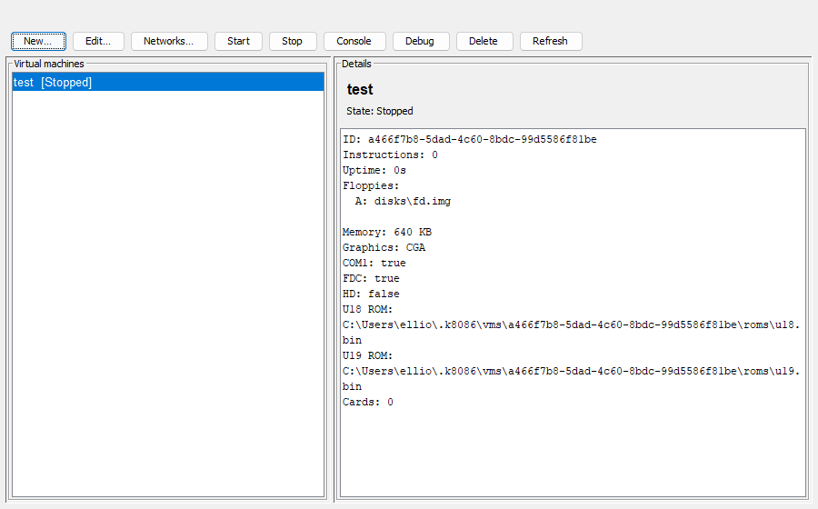

# k8086

[](https://github.com/Trugath/k8086/actions/workflows/ci.yml)
[](LICENSE)
[](https://github.com/Trugath/k8086/releases)

IBM 5155 / 5160-class PC emulator in Kotlin. Boots XT-compatible system ROMs
(default: rmDOS U18/U19), emulates XT motherboard peripherals, and runs rmDOS
and classic DOS software from disk images.

Multi-module workstation: reusable emulator, in-process multi-VM host, and a
VirtualBox-style manager UI.



**License:** [MIT](LICENSE) — see [NOTICE](NOTICE) for third-party attribution
(bundled rmDOS assets, CGA font, optional SingleStepTests, etc.).

## Prerequisites

- JDK **21** (runtime for the packaged app; Gradle toolchain / foojay for building)
- Linux / macOS / Windows with a display for the manager / CGA console
  (headless tests set `showVideo = false`)

## Download (no Gradle)

Prebuilt workstation zips are attached to
[GitHub Releases](https://github.com/Trugath/k8086/releases):

1. Install JDK 21+
2. Download `k8086-*.zip`, unzip
3. Run **`run.bat`** / **`./run.sh`** (workstation UI), or **`run-cli.bat`** /
   **`./run-cli.sh`** for the single-instance CLI (supports `--headless`)

The zip includes jars, default rmDOS ROMs (`roms/`), and boot floppy
(`disks/fd.img`). Unix scripts are executable in the zip. To publish a release,
push a tag such as `v0.8.0` (CI builds the zip, smokes a headless boot, and
attaches it to the release).

## Clone

```bash
git clone https://github.com/Trugath/k8086.git
cd k8086
```

Submodules (SingleStepTests) are **optional** and large — skip them unless you
run the CPU conformance gates (see [Tests](#tests)).

## Build and run

### Multi-VM workstation (recommended)

```bash
./gradlew :k8086-app:run
```

Opens the manager: New → wizard (ROMs + hardware) → Start → Console.
VM definitions persist under `~/.k8086/vms/` (immutable ROM snapshots under
`vms/<id>/roms/`). Use **Edit…** while a VM is stopped for the full settings
dialog (name, ROMs, adapters, drives, cards).

Step-by-step with screenshots: [Getting started](docs/getting-started.md).

Package a zip for local use or manual upload to a GitHub Release:

```bash
./gradlew :k8086-app:distZip
# → k8086-app/build/distributions/k8086-1.0-SNAPSHOT.zip
./gradlew :k8086-app:distZip -PreleaseVersion=1.0.0
```

### Single-instance emulator

Shipped assets are enough for a cold clone (no parent rmDOS tree required):

```bash
./gradlew :k8086-emulator:run --args='disks/fd.img'
./gradlew :k8086-emulator:run   # no args → Swing start wizard
./gradlew :k8086-emulator:run --args='disks/fd.img --headless --serial-log /tmp/com1.log --quiet'
```

CLI flags: `--headless` (no CGA window, full-speed), `--serial-log PATH` (COM1 TX
capture), `--quiet` (suppress usage banner). Guest write of ASCII `Shutdown` to
port `0x8900` stops the run loop and exits 0.

The wizard configures **motherboard options** (RAM size, software 8087, SW1 video),
**system adapters** (CGA, floppy controller, hard-disk controller, COM1), and optional
ISA JARs. The hard-disk controller maps classic XT resources (`0x320` / IRQ5 / DMA3)
to a Xebec-style port model; INT 13h is owned by the guest C800 Fixed Disk option
ROM by default (host Fixed Disk BIOS opt-in via `--hd-int13-bios`; legacy
direct-image shim still available for tests).

Optional hard disk via CLI (creates a blank ~10 MB image if missing):

```bash
./gradlew :k8086-emulator:run --args='disks/fd.img hd.img'
./gradlew :k8086-emulator:run --args='disks/fd.img @hd.img'   # boot from hard disk
```

ISA expansion cards (JAR plugins):

```bash
./gradlew :cards:sample-rom:jar
./gradlew :k8086-emulator:run --args="disks/fd.img --card cards/sample-rom/build/libs/sample-rom-1.0-SNAPSHOT.jar"
```

## Assets

| Path | Role |
|------|------|
| [`roms/`](roms/README.md) | Default system ROMs (`u18.bin` + `u19.bin`, rmDOS) |
| [`disks/`](disks/README.md) | rmDOS boot floppy (`fd.img`, 720 KB) |

These are committed for a standalone clone. When developing alongside
[rmDOS](https://github.com/Trugath/rmdos), you can rebuild and refresh them from
that tree (`make bios` / `make install-roms` / `make install-floppy`).

Override ROM paths with `K8086_U18_ROM` / `K8086_U19_ROM`, or pick alternate images
when creating/editing a VM in the workstation.

## Modules

| Module | Purpose |
|--------|---------|
| [`k8086-app`](k8086-app/) | All-in-one workstation entry |
| [`k8086-client`](k8086-client/) | Manager + console UI |
| [`k8086-host`](k8086-host/) | Multi-VM host (`LocalHost`) |
| [`k8086-net`](k8086-net/) | Virtual NAT networks + DHCP gateway |
| [`k8086-protocol`](k8086-protocol/) | `HostApi` + VM DTOs |
| [`k8086-emulator`](k8086-emulator/) | CPU, machine, CLI / wizard |
| [`k8086-api`](k8086-api/) | Public SPI for ISA card plugins |
| [`cards/*`](cards/README.md) | Example ISA cards |

## Docs

| Doc | Contents |
|-----|----------|
| [docs/getting-started.md](docs/getting-started.md) | First boot with the workstation UI |
| [docs/manual.md](docs/manual.md) | Manager, wizard, console, debugger, networks |
| [docs/architecture.md](docs/architecture.md) | Module map, multi-VM host, boot path, CPU/FPU |

Screenshots under `docs/screenshots/` are refreshed with
`./gradlew :k8086-app:docScreenshots`.

## Tests

```bash
./gradlew test
```

Integration tests that boot rmDOS (`BootIntegrationTest`, `WarmBootCadFromDosTest`)
need `roms/` and `disks/fd.img` present; they skip when assets are missing.

### Hardware-generated 8086 / 8088 / 80286 conformance tests (optional)

The [SingleStepTests/8086](https://github.com/SingleStepTests/8086),
[SingleStepTests/8088](https://github.com/SingleStepTests/8088), and
[SingleStepTests/80286](https://github.com/SingleStepTests/80286) corpora are pinned
as Git submodules (MIT; see [NOTICE](NOTICE)). **Not required** to build or run the
emulator. The 8088 corpus is multi-gigabyte.

```bash
git submodule update --init --recursive
```

For a smaller 8088 checkout (v2 vectors only):

```bash
git -C testdata/8088 sparse-checkout init --cone
git -C testdata/8088 sparse-checkout set v2
```

The machine defaults to an **8088** (IBM 5155/5160). The start wizard and VM
motherboard options can select **8086** or real-mode **80286** instead; all share
one instruction engine (`CpuModel`).

**Acceptance gates** (all runnable opcodes, 2000 vectors each): must exit 0.

```bash
./gradlew :k8086-emulator:singleStep8086Test
./gradlew :k8086-emulator:singleStep8088Test
./gradlew :k8086-emulator:singleStep80286Test
```

Smoke preset (useful in PR CI):

```bash
./gradlew :k8086-emulator:singleStep8086Test \
  -PsingleStepOpcodes=00,04,27,28,2F,90 \
  -PsingleStepLimit=200 \
  -PsingleStepFailures=5
```

Focused run:

```bash
./gradlew :k8086-emulator:singleStep8088Test \
  -PsingleStepOpcodes=04,80.0,D1.4 \
  -PsingleStepLimit=100 \
  -PsingleStepFailures=20
```

The 8086/8088 runners overlay each vector’s `bytes` at `CS:IP` (with 16-bit IP wrap),
apply `metadata.json` undefined-flag masks, and validate registers, flags, IP, and
listed RAM. Prefetch queue state and bus cycles are not validated.

The 80286 runner uses the `v1_real_mode` **MOO** corpus (HALT-terminated vectors,
revocation list), with the same state-level scope.
