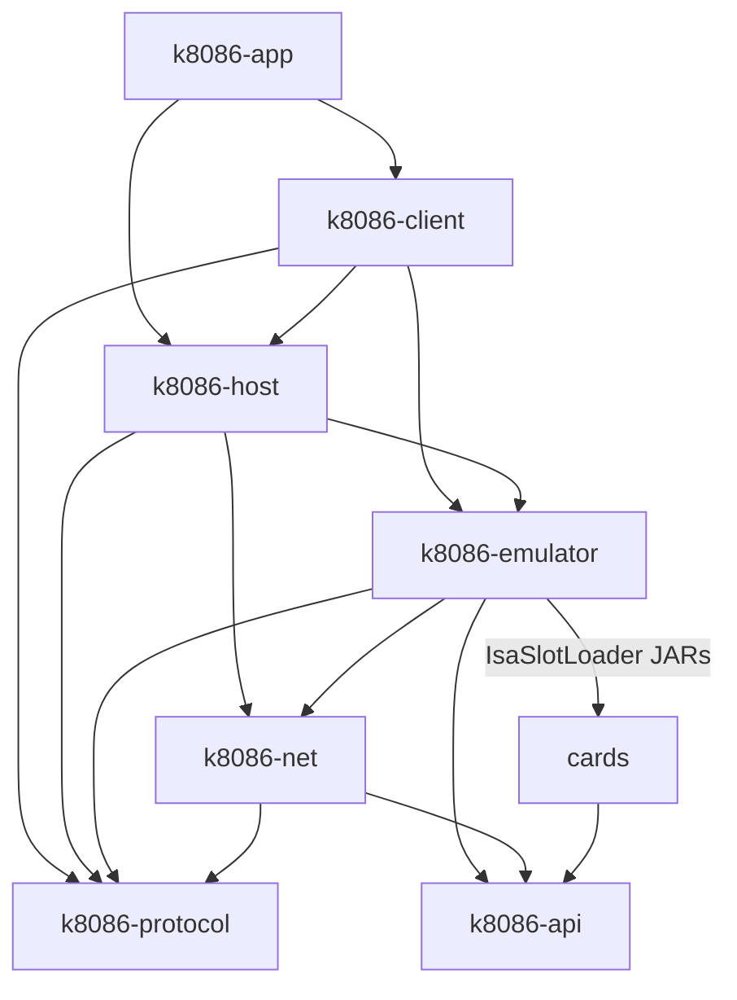
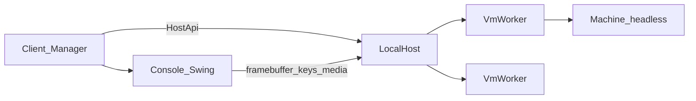

# k8086 architecture

IBM 5155 / 5160-class emulator in Kotlin: XT system ROMs, motherboard
peripherals, multi-VM host, and a workstation UI. Default guest assets are
rmDOS (`roms/u18.bin`, `roms/u19.bin`, `disks/fd.img`).

## Module map

| Module | Role |
|--------|------|
| **`k8086-app`** | All-in-one workstation: embeds `LocalHost` + manager UI |
| **`k8086-client`** | Swing manager + console / debug windows; talks to `HostApi` |
| **`k8086-host`** | VM registry, persistence (`~/.k8086/vms/`), per-VM worker threads |
| **`k8086-net`** | Virtual NAT networks, DHCP, userspace gateway (`~/.k8086/networks/`) |
| **`k8086-protocol`** | Wire-ready DTOs + `HostApi` / `NetworkApi` |
| **`k8086-emulator`** | CPU, machine, XT peripherals, single-instance CLI / wizard |
| **`k8086-api`** | Stable SPI for ISA card plugins |
| **`cards/*`** | Example ISA JARs (ServiceLoader) |

### Emulator packages (`com.trugath.k8086`)

| Package | Contents |
|---------|----------|
| `cpu/` | `Emulator8088` / `8086` / `80286`, decode & cycle tables, 8087 glue |
| `cpu/fpu/` | Software 8087: `Ext80`, ESC decode, formats, transcendentals |
| `bus/` | `MemoryBus`, `IoBus` |
| `chipset/` | PIC, PIT, PPI, DMA, keyboard, speaker, UART (COM1), shutdown port |
| `video/` | CGA + composite decoder; framebuffer export for host consoles |
| `storage/` | FDC, XT Fixed Disk Adapter (`Wd1003`), FixedDiskBios / INT 13h |
| `config/` | `MotherboardConfig`, `MachineSetup`, card catalog |
| `isa/` | Card host + JAR slot loader |
| `ui/` | Start wizard (CLI and workstation New-VM flow) |

## Multi-VM host

- Each running VM has a dedicated worker: `loadCards` (if any) → `Machine.prepareBoot` → `Machine.run`.
- Cooperative `requestStop()` exits the loop; `shutdown()` detaches cards, closes disks/speaker, disposes owned windows.
- Headless machines keep CGA rendering in memory; the client polls `pollConsoleFrame` and sends scan codes / CAD / floppy changes via `HostApi`.
- Disk image paths are claimed exclusively while a VM runs.
- Networking: virtual NAT networks (`NetworkRegistry` / `k8086-net`) with optional DHCP; ISA NIC cards attach via `IsaHost.attachNic`.

### Debug window

The manager **Debug** button (also on the console toolbar) opens a per-VM
inspector that talks only to `HostApi`:

| Method | Role |
|--------|------|
| `getCpuDebugState` | Registers, flags, CS:IP, next-instruction hex |
| `readGuestMemory` | Physical hex dump (capped length) |
| `pauseVm` / `resumeVm` / `stepVm` | Cooperative pause; one `Machine` iteration while paused |
| `addBreakpoint` / `removeBreakpoint` / `listBreakpoints` | Linear CS:IP breakpoints |

`Machine.run` and `stepOnce` share `runOneIteration`. Free-run pauses before
executing a hit; **Step** ignores the hit so that instruction can proceed.
Mnemonic disassembly is not implemented (decode tables expose lengths, not names).

## Boot path (single machine)

1. Load U18 + U19 into `0xF6000–0xFFFFF` (`loadSystemRoms`).
2. CPU reset at `0xFFFF0` far-jumps into POST (`F000:E05B` on rmDOS ROMs).
3. `MotherboardConfig` sets SW1 (8087 / RAM banks / initial video) and caps
   conventional RAM so POST’s memory count matches the configured size (64–640 KB).
4. Floppy I/O goes through the emulated uPD765. Hard-disk I/O uses an XT Fixed
   Disk Adapter (`Wd1003`) at `0x320–0x327` (IRQ5 / DMA3). INT 13h for `DL ≥ 0x80`
   is served by `FixedDiskBios`; set `useInt13Shim` for the legacy direct-image
   shim. Prefix `@` on the HD path to boot from it.
5. Optional system adapters (wizard / `MachineOptions`): CGA, FDC, COM1, HD controller.
6. Optional ISA JAR cards attach via `loadCards` before `prepareBoot` so option
   ROMs are visible during POST.
7. Single-instance: `./gradlew :k8086-emulator:run`. Workstation: `./gradlew :k8086-app:run`.

ROM layout and overrides: [roms/README.md](../roms/README.md).
Disk images: [disks/README.md](../disks/README.md).

## CPU

`CpuModel` selects **8088** (XT default), **8086**, or real-mode **80286**. All
share one open instruction engine; peripherals take the base `Emulator8086` type.
Motherboard choice is persisted as `mb.cpu`. The 286 option implements 80186
opcodes and real-mode `0x0F` (SMSW/LMSW/CLTS); protected mode and AT chipset are
out of scope.

Architectural correctness is gated by optional SingleStepTests corpora:

| CPU | Corpus | Gradle task |
|-----|--------|-------------|
| 8086 | [SingleStepTests/8086](https://github.com/SingleStepTests/8086) `v1` | `:k8086-emulator:singleStep8086Test` |
| 8088 | [SingleStepTests/8088](https://github.com/SingleStepTests/8088) `v2` | `:k8086-emulator:singleStep8088Test` |
| 80286 | [SingleStepTests/80286](https://github.com/SingleStepTests/80286) `v1_real_mode` | `:k8086-emulator:singleStep80286Test` |

Notable modeled behaviors: PUSH SP post-decrement (808x) vs pre-decrement (286),
`FF /7` / `F6/F7 /1` aliases, REP/REPNE × MUL via F1, deferred `#DE` IP push on
808x, 16-bit offset wrap for code/stack/memory word accesses.

`Machine` advances peripherals from a coarse per-opcode cycle estimate
(`lastInstructionCycles`), not a flat constant. This is not 8088-prefetch-accurate.
NMI is available via `Emulator8086.requestNmi()` / `IsaHost.requestNmi()` (INT 2).

## Math coprocessor (8087)

When the motherboard “8087” option is enabled, ESC opcodes run synchronously
through `MathCoprocessor8087`:

- Eight-register stack with TOP/tag tracking
- Internal 80-bit values (`Ext80`); host `Double` only for transcendentals
- Table-driven ESC decode, real/integer/BCD formats, arithmetic, compares,
  constants, environment save/restore (FIP/FDP), common transcendentals
- Unmasked exceptions assert the 8088 NMI input (XT wiring)
- Absent socket: ESC remains a CPU no-op; SW1 / INT 11h bit clear

WAIT is a cheap no-op (no BUSY# stall). Cycle-accurate ESC costs and silicon ULP
matching for transcendentals are not goals.

## ISA cards

Cards are JARs discovered via `ServiceLoader` implementing `k8086-api`. Examples
under `cards/`: sample ROM, AdLib, EMS window, RAM UMB, heartbeat, DE-220
(NE2000-class NIC for guest DHCP/PING). See [cards/README.md](../cards/README.md).

## Persistence

VM definitions and immutable ROM snapshots live under `~/.k8086/vms/<id>/`.
Network definitions under `~/.k8086/networks/`. Named hierarchical save-states
(full machine snapshots) are not implemented; pause/step/breakpoints cover
interactive debugging only.
