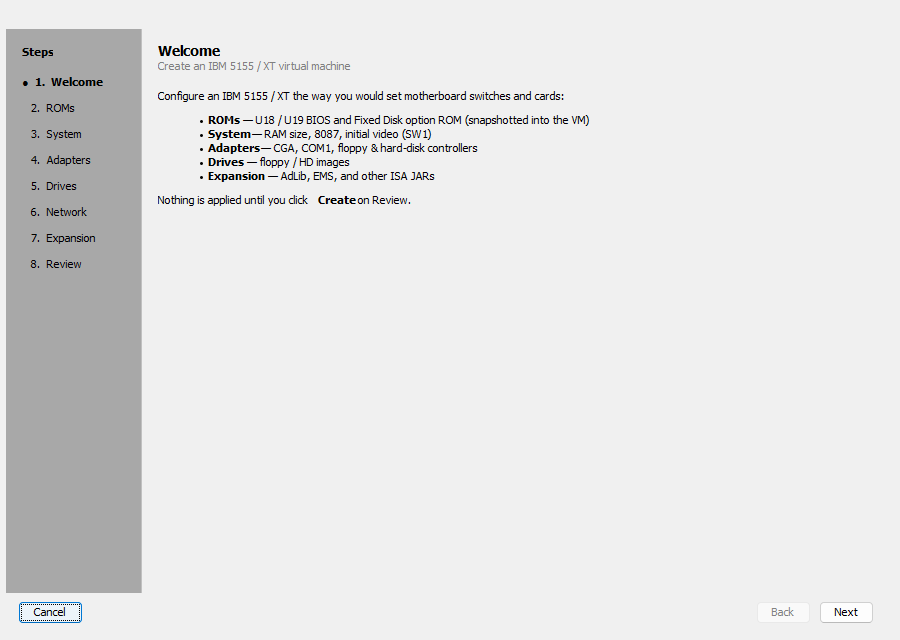
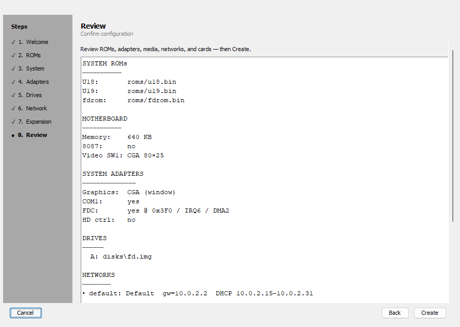
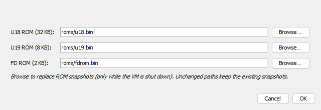
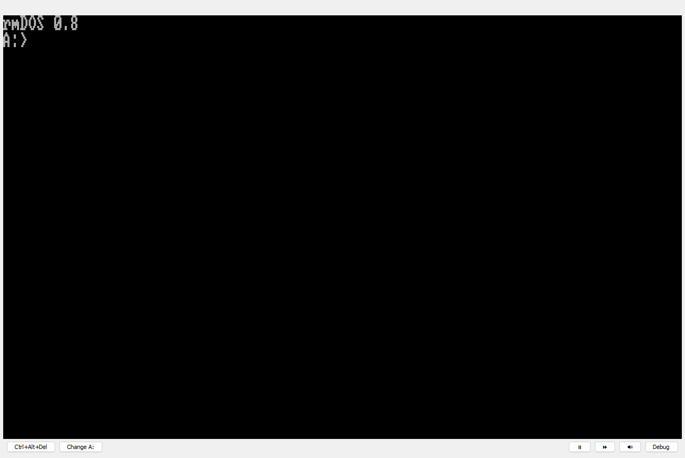

# Getting started with k8086

Boot an IBM 5155 / XT-class VM in a few minutes using the workstation UI and the
shipped rmDOS ROMs + floppy.

## Prerequisites

- JDK **21+**
- A display (the manager and CGA console are Swing windows)

### Option A — packaged zip (no Gradle)

1. Download `k8086-*.zip` from
   [GitHub Releases](https://github.com/Trugath/k8086/releases) and unzip.
2. Run **`run.bat`** (Windows) or **`./run.sh`** (Linux / macOS).

ROMs and `disks/fd.img` are already inside the zip.

### Option B — from source

Clone with `roms/u18.bin`, `roms/u19.bin`, and `disks/fd.img`:

```bash
git clone https://github.com/Trugath/k8086.git
cd k8086
./gradlew :k8086-app:run
```

## Launch the workstation

After starting via the zip or Gradle, the **k8086 Workstation** manager opens.
VM definitions live under `~/.k8086/vms/`.


## Create a VM

1. Click **New…**
2. Walk the wizard (Welcome → System → Adapters → Drives → Network → Expansion → Review).
   Defaults boot rmDOS from `disks/fd.img` with CGA, COM1, and a floppy controller.
3. On Review, click **Create**.





4. Enter a VM name when prompted.
5. Confirm system ROMs (defaults are the shipped rmDOS U18/U19). Images are copied
   into the VM as immutable snapshots.



## Start and open the console

1. Select the VM in the list.
2. Click **Start**, then **Console**.

You should see rmDOS POST, then a prompt similar to:

```text
rmDOS 0.7
A:>
```



Type guest commands with the console focused. Use **Ctrl+Alt+Del** on the toolbar
for a warm boot (CAD), and **Change A:** to insert or eject a floppy image while
running.

## Stop

Back in the manager, click **Stop**. Use **Edit…** only while the VM is stopped
(rename or replace ROM snapshots).

## Next steps

- Full UI reference: [User manual](manual.md)
- Architecture / modules: [architecture.md](architecture.md)
- Optional CPU conformance corpora and CLI flags: [README](../README.md)

To refresh these screenshots after UI changes:

```bash
./gradlew :k8086-app:docScreenshots
```
