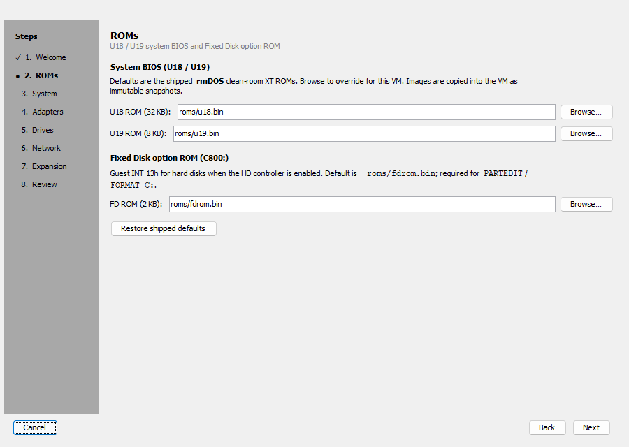

# Getting started with k8086

Boot an IBM 5155 / XT-class VM in a few minutes using the workstation UI and the
shipped rmDOS ROMs + floppy.

## Prerequisites

- JDK **21+**
- A display (the manager and CGA console are Swing windows)

### Option A — packaged zip (no Gradle)

1. Download `k8086-*.zip` from
   [GitHub Releases](https://github.com/Trugath/k8086/releases) and unzip.
2. Run **`run.bat`** (Windows) or **`./run.sh`** (Linux / macOS).

ROMs and `disks/fd.img` are already inside the zip.

### Option B — from source

Clone with `roms/u18.bin`, `roms/u19.bin`, and `disks/fd.img`:

```bash
git clone https://github.com/Trugath/k8086.git
cd k8086
./gradlew :k8086-app:run
```

## Launch the workstation

After starting via the zip or Gradle, the **k8086 Workstation** manager opens.
VM definitions live under `~/.k8086/vms/`.


## Create a VM

1. Click **New…**
2. Walk the wizard (Welcome → **ROMs** → System → Adapters → Drives → Network →
   Expansion → Review). Defaults use shipped rmDOS U18/U19 + `fdrom.bin`, boot from
   `disks/fd.img`, and enable CGA, COM1, and a floppy controller.
3. On Review, click **Create**, then enter a VM name when prompted.

ROM images are copied into the VM as immutable snapshots under
`~/.k8086/vms/<id>/roms/`.





## Start and open the console

1. Select the VM in the list.
2. Click **Start**, then **Console**.

You should see rmDOS POST, then a prompt similar to:

```text
rmDOS 0.8
A:\>
```


Type guest commands with the console focused (Tab stays on the display, not the
toolbar). Use **Ctrl+Alt+Del** on the toolbar for a warm boot (CAD), and
**Change A:** to insert or eject a floppy image while running. Right-click the
display to paste clipboard text.

## Stop

Back in the manager, click **Stop**. Use **Edit…** only while the VM is stopped
to open the full settings dialog (name, ROMs, hardware, cards).

## Next steps

- Full UI reference: [User manual](manual.md)
- Architecture / modules: [architecture.md](architecture.md)
- Optional CPU conformance corpora and CLI flags: [README](../README.md)
- ISA cards (1MB memory expansion, SixPak-style RTC/serial/LPT/gameport): [cards/README.md](../cards/README.md)

### Recipe: 5155-like 256K + 1MB mem + SixPak I/O

In the New-VM wizard: set motherboard memory to **256 KB**, keep COM1/CGA/floppy,
then on **Expansion** add JARs from `cards/*/build/libs/` after
`./gradlew :cards:mem-expansion:jar :cards:uart-8250:jar :cards:rtc-mm58167:jar :cards:lpt:jar :cards:gameport:jar`.
Defaults fill conventional RAM to 640K, map UMB at `D0000`, and add COM2/RTC/LPT2/gameport.
See [cards/README.md](../cards/README.md) for CLI `--card` equivalents.

To refresh these screenshots after UI changes:

```bash
./gradlew :k8086-app:docScreenshots
```
