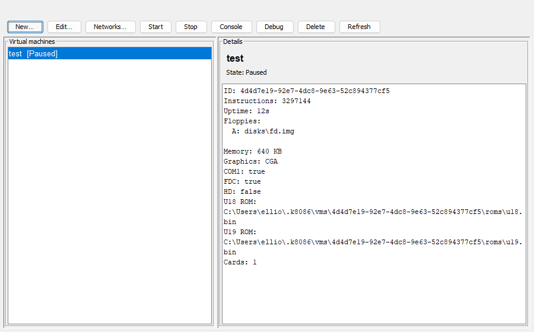
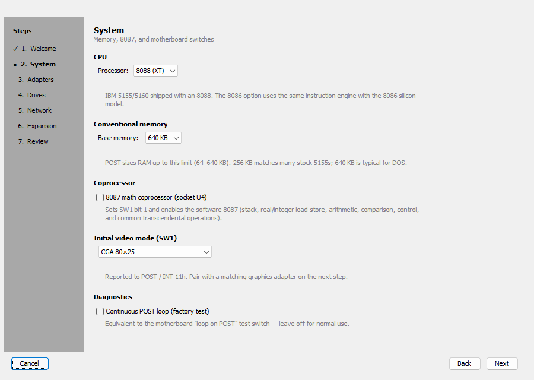
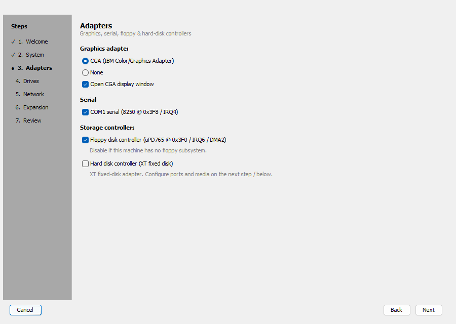
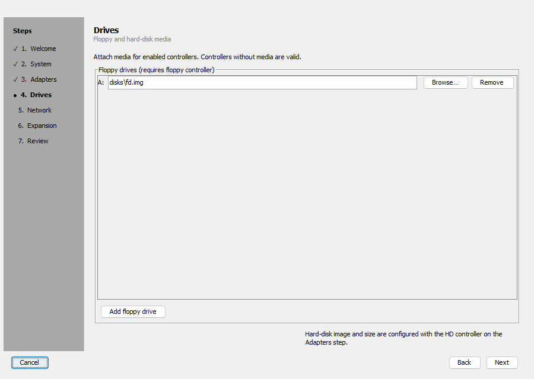
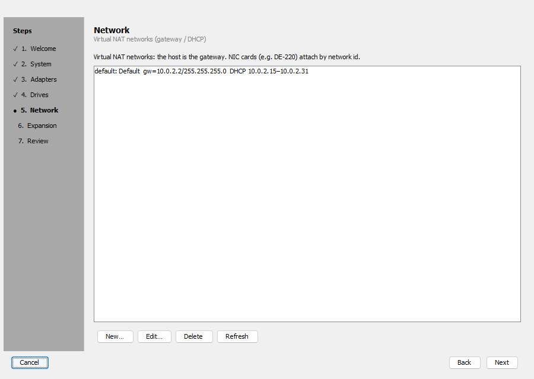
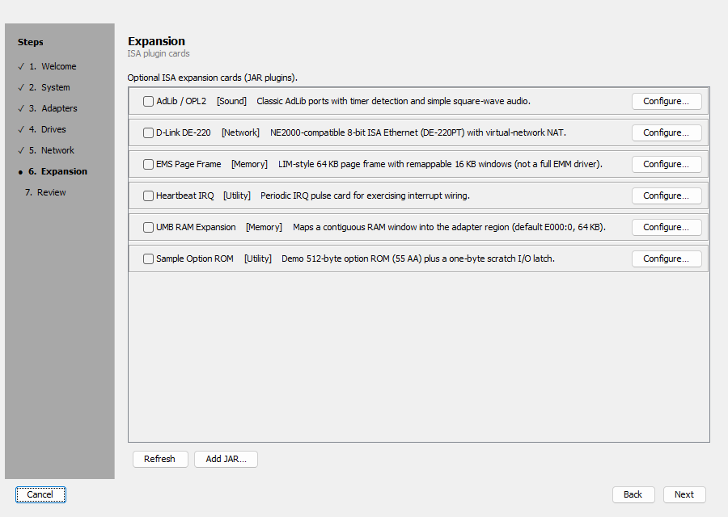
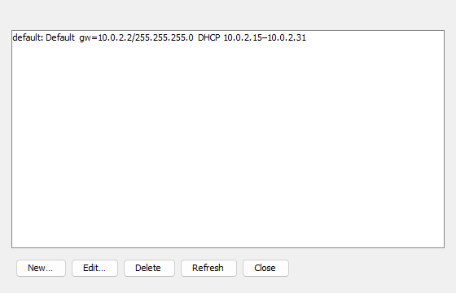
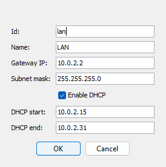
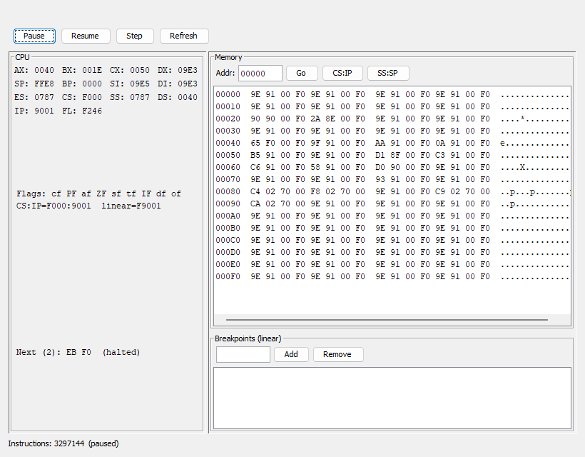

# k8086 user manual

Reference for the multi-VM **workstation** (`./gradlew :k8086-app:run`). For a
first boot walkthrough, see [Getting started](getting-started.md).

Persistence:

| Path | Contents |
|------|----------|
| `~/.k8086/vms/<id>/` | VM definition (`vm.properties`) and ROM snapshots |
| `~/.k8086/networks/` | Virtual NAT network definitions |

Disk image paths you choose (floppies / hard disks) stay where you put them; the
host claims them exclusively while a VM is running.

---

## Manager window


Toolbar:

| Button | Action |
|--------|--------|
| **New…** | Create VM wizard → name → ROM picker |
| **Edit…** | Rename / replace ROM snapshots (VM must be stopped or in error) |
| **Networks…** | Manage virtual NAT networks |
| **Start** / **Stop** | Run or cooperatively stop the selected VM |
| **Console** | Open the CGA console (VM must be starting, running, or paused) |
| **Debug** | Open the CPU/memory debugger |
| **Delete** | Remove the VM definition (disk images on disk are kept) |
| **Refresh** | Reload the VM list |

The left list shows each VM and its state. The details pane shows id, live
metrics (instruction count, uptime, floppies), motherboard/adapters, and ROM
paths.



---

## New VM wizard

Opened from **New…**. Nothing is applied until you click **Create** on Review
(then name the VM and confirm ROMs).

### Welcome


### System

CPU model (8088 / 8086 / real-mode 80286), conventional memory (64–640 KB),
optional software 8087, SW1 initial video mode, and optional continuous POST loop.



### Adapters

CGA (or none), COM1 UART, floppy controller, and optional XT hard-disk controller.



### Drives

Floppy image paths (A:/B:/…) when the FDC is enabled. With the HD controller
enabled, set image path, XT I/O / IRQ / DMA, size for new images, and optional
boot-from-HD.



### Network

Lists virtual networks available to NIC cards (see [Networks](#networks)). Create
or edit networks here or from the manager **Networks…** dialog.



### Expansion

ISA plugin JARs discovered on the classpath / catalog (AdLib, DE-220, EMS window,
UMB RAM, samples, …). Enable cards and use **Configure…** for per-card options.
**Add JAR…** loads an external plugin.



### Review

Summary plus validation. **Create** returns the setup to the manager (CLI uses
**Start** and boots immediately).


### ROM picker

After Create, choose U18 (32 KB) and U19 (8 KB) sources. Defaults are
`roms/u18.bin` and `roms/u19.bin`. Copies under `~/.k8086/vms/<id>/roms/` are
immutable snapshots for that VM.


**Edit…** on a stopped VM reuses the same name + ROM dialogs.

---

## Networks



Each network has an id, display name, gateway IP, subnet mask, and optional DHCP
range. Guests with a NIC card (for example DE-220) attach by network id.



The default network is typically `10.0.2.2/24` with DHCP `10.0.2.15`–`10.0.2.31`
(QEMU-like NAT layout). See [architecture.md](architecture.md) for the host/NAT
module map.

---

## Console


Opens only when the VM is starting, running, or paused. Focus the black display
to send keyboard scan codes to the guest.

| Control | Role |
|---------|------|
| **Ctrl+Alt+Del** | Inject CAD (warm boot path) |
| **Change *n*:** | Insert image, eject, or cancel for that floppy unit |
| Pause / play | Cooperative pause / resume |
| Turbo (⏩) | Toggle max-speed vs realtime pacing |
| Speaker | Mute / unmute PC speaker (and card audio when applicable) |
| **Debug** | Open the debugger for this VM |

Closing the console does not stop the VM.

---

## Debugger



Also available from the manager **Debug** button.

| Control | Role |
|---------|------|
| **Pause** / **Resume** | Cooperative run-state |
| **Step** | One machine iteration while paused (auto-pauses if needed) |
| **Refresh** | Reload registers / memory / breakpoints |

- **CPU** — general registers, flags (uppercase = set), CS:IP, linear address,
  next instruction bytes; `(halted)` when the CPU is in HLT.
- **Memory** — hex dump from a linear address; **CS:IP** / **SS:SP** jump helpers.
- **Breakpoints** — linear CS:IP addresses; free-run pauses before a hit; **Step**
  ignores the hit so that instruction can proceed.

Mnemonic disassembly is not implemented yet (lengths and hex only).

---

## Single-instance emulator (optional)

Without the multi-VM host:

```bash
./gradlew :k8086-emulator:run --args='disks/fd.img'
./gradlew :k8086-emulator:run   # no args → same wizard; finish button is Start
```

Useful flags: `--headless`, `--serial-log PATH`, `--quiet`, `--card path/to.jar`.
See the [README](../README.md) for hard-disk CLI forms and card examples.

---

## Regenerating screenshots

From the repo root (requires a display and an existing VM under `~/.k8086/vms`
for console/debug shots):

```bash
./gradlew :k8086-app:docScreenshots
```

Output directory: `docs/screenshots/` (override with `-PdocScreenshotDir=…`).
